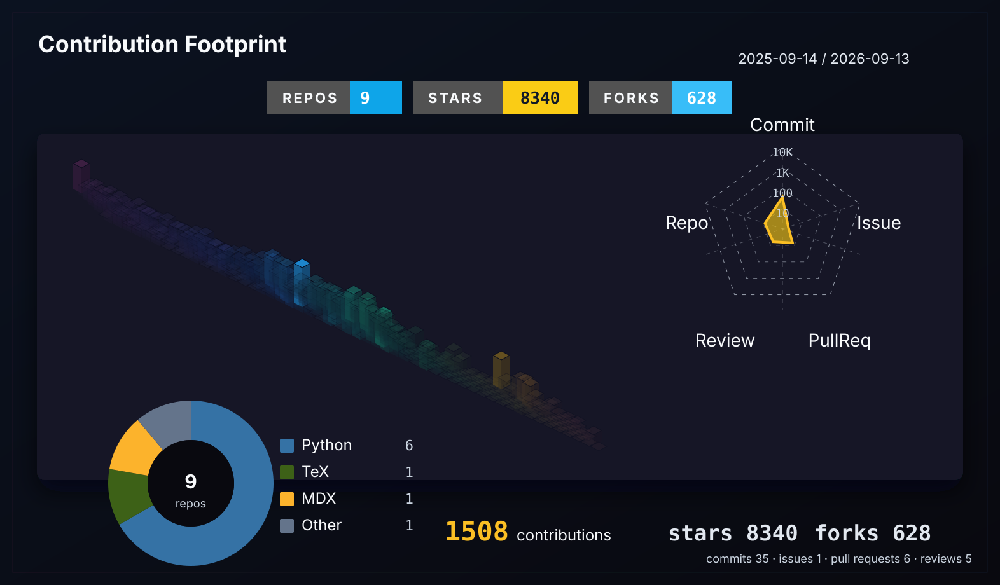

<div align="center">

# Xiao Ao Jiang Hu

<p>Writing code, negotiating with requirements, and occasionally surviving deployment windows.</p>

<p>
  <a href="https://github.com/Xiao-ao-jiang-hu">GitHub</a> ·
  <a href="https://xiaoaojianghu.fun">Website</a> ·
  <a href="https://blog.xiaoaojianghu.fun">Blog</a> ·
  <a href="mailto:xiaoaojianghu425@gmail.com">Email</a>
</p>

</div>

### 🤺 About Me


<p>Hi, I am Xiao Ao Jiang Hu, someone who treats requirements like riddles and bugs like old acquaintances.</p>
<p>I make code look runnable; whether it actually runs is a private conversation between CI and tonight's luck.</p>

### 📃 Recent Posts

<!-- BLOG:START -->
- **2026-06-15** - [复分析期末复习题目集合](https://blog.xiaoaojianghu.fun/posts/6e048df1.html)
- **2026-06-13** - [超几何方程与自守函数讲义总结](https://blog.xiaoaojianghu.fun/posts/ec4631e8.html)
- **2026-06-13** - [椭圆曲线与Mordell定理讲义总结](https://blog.xiaoaojianghu.fun/posts/895beb02.html)
- **2026-06-13** - [上半平面的几何讲义总结](https://blog.xiaoaojianghu.fun/posts/4ef42e3f.html)
- **2026-06-13** - [Stein复分析Chap9.2总结](https://blog.xiaoaojianghu.fun/posts/b849d344.html)
<!-- BLOG:END -->

### 📊 WakaTime

<!-- WAKATIME:START -->
**This Week I Spent My Time On**

```text
🕑 Time Zone: Asia/Shanghai

💬 Programming Languages:
Python                   51 hrs 41 mins     ███████░░░░░░░░░░░░░░░░░░   26.14 %
Markdown                 34 hrs 33 mins     ████░░░░░░░░░░░░░░░░░░░░░   17.47 %
Other                    24 hrs 35 mins     ███░░░░░░░░░░░░░░░░░░░░░░   12.43 %
TypeScript               23 hrs 25 mins     ███░░░░░░░░░░░░░░░░░░░░░░   11.85 %
Rust                     18 hrs 11 mins     ██░░░░░░░░░░░░░░░░░░░░░░░   9.20 %

🔥 Editors:
VS Code                  190 hrs 6 mins     ████████████████████████░   96.12 %
Codex CLI                7 hrs 40 mins      █░░░░░░░░░░░░░░░░░░░░░░░░   3.88 %

💻 Operating Systems:
Mac                      90 hrs 0 mins      ███████████░░░░░░░░░░░░░░   45.51 %
Windows                  57 hrs 22 mins     ███████░░░░░░░░░░░░░░░░░░   29.01 %
Linux                    50 hrs 24 mins     ██████░░░░░░░░░░░░░░░░░░░   25.48 %
```

Range: 2026-05-23 -> 2026-06-21
Last 30 days total: 197 hrs 46 mins
<!-- WAKATIME:END -->

### 🧰 Tech Stack

<p>
  
  
  
  
  
  
  
  
  
  
  
  
  
  
  
</p>

<p align="center">
  
</p>

<p align="center">
  
  
  
  
  
  
  
  
  
  
  
</p>


### 📈 Contribution Footprint

<!-- GITHUB:START -->
<p align="center"></p>
<!-- GITHUB:END -->


